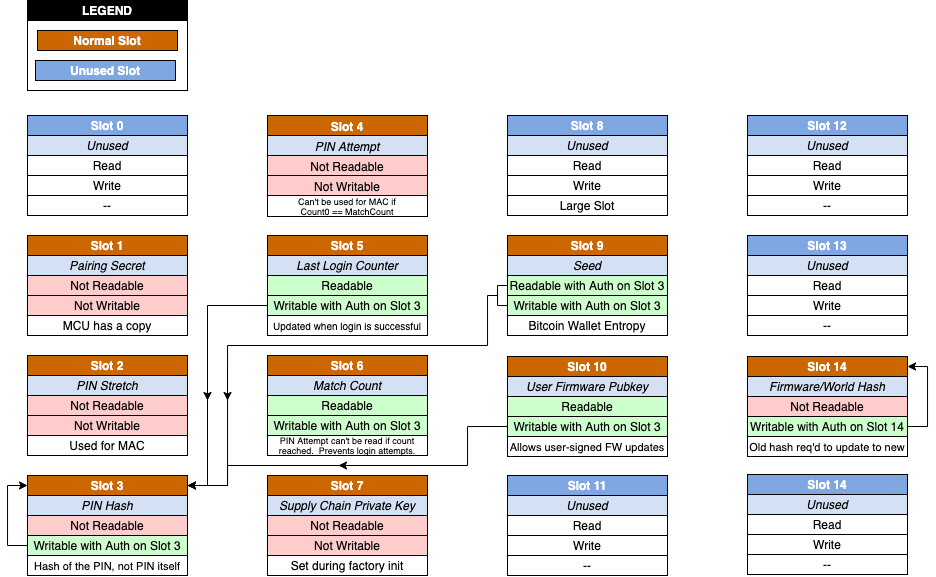

<!--
SPDX-FileCopyrightText: © 2021 Foundation Devices, Inc. <hello@foundationdevices.com>

SPDX-License-Identifier: GPL-3.0-or-later
-->

# Passport Security Model

## 1. Hardware Overview
Passport strives to offer best-in-class hardware security through a model of security-via-openness. Our hardware security philosophy can be described as follows:

* Be as transparent as possible, with open source circuit designs, schematics, and bill of materials. Vulnerabilities can be more quickly discovered in an open source model. 

* Only purchase components through reputable suppliers and distributors. This means buying from American companies like Arrow, Digikey, and Mouser. 

* Make use of available components, so that experts can build their own Passports from scratch without our knowledge or permission. 

* Use more trustable components, such as a tamper-evident screen, an open source true random number generator, and standard AAA batteries. 

* Minimize the use of black-box silicon; i.e., closed source chips running unknown firmware. Use only chips from reputable suppliers like STM and Microchip, and try to use “dumb” chips that are not running any OS or executing unknown code. 

* Assemble our hardware in the USA, including circuit boards, under close supervision by Foundation Devices team members. 

Completely air-gapped, Passport communicates only via QR codes or microSD cards – Passport includes no USB port or wireless communications of any kzind.

Passport uses the following key components:

* STMicroelectronics STM32H753 microcontroller. Our open source MicroPython code runs on this processor. This is the only chip in Passport that executes code, and we know 100% of the code running on this chip. 

* Microchip ATECC608A secure element. This security chip is explicitly designed to safeguard private keys, but is simple enough that it does not execute any code. We use the 608a primarily for its secure key storage slots. 

* Sharp LS018B7DH02 memory display. In addition to being ultra low power, this screen has its circuitry etched directly into glass instead of using an embedded processor. Its circuitry can be visually inspected, and is therefore considered tamper-evident. 

* Omnivision OVM7690 camera. This camera assembly provides an image output to our STM microcontroller. No QR processing occurs on the camera; all QR processing takes place in our open source code on the microcontroller. 

* MicroSD card slot. This is used for firmware updates and large PSBTs. 

* Physical keypad. This is used for navigation and user input and is considered tamper-evident. 

* Avalanche noise source. This open source implementation of a true random number generator allows for a provable source of entropy without any black-box silicon. Same general design used by bunnie in the Betrusted project. 

* Ambient light sensor. 

* ADP 5587 keypad controller chip. 

* 2MB External SPI Flash. This provides temporary storage for firmware updates and a UTXO cache.

## 2. Glossary of Terms
The following definitions are used in the descriptions in the remainder of this document.

* **Device Hash** - A SHA256 hash over the MCU's unique ID, the Secure Element's unique ID, and the device's one-time pad.  This hash is used in several places when a value is needed that ties strongly to a specific Passport. 

* **JTAG** - A standard for connecting debug probe hardware to an embedded system such as Passport. This tool is most commonly used by embedded system developers.  JTAG gets its name from the **J**oint **T**est **A**ction **G**roup, which codified the standard.

* **MCU** - An acronym for **M**icro**C**ontroller **U**nit. This is the embedded equivalent of a CPU.  Passport's MCU is the STM32H753. 

* **One-Time Pad** - A random number (72 bytes in Passport) that is used for encoding and encrypting various values as described below.  The Passport One-Time Pad is also hashed into the Device Hash. 

* **RDP** - An acronym for **R**ea**D**-out **P**rotection, which is a security feature of STM32 microprocessors which can prevent attackers from accessing the MCU using a JTAG debugger. 

* **Secure Element** - A security ASIC that provides secure storage and retrieval of secret data, also allowing for supply chain attestations, PKI support and other security-related hardware functions. Passport uses the Microchip ATECC608A Secure Element.

* **XFP** - The e**X**tended **F**inger**P**rint is obtained from the first 4 bytes of the RIPEMD160 hash of the SHA256 hash of a public key.  This is usually the master public key, resulting in what is sometimes referred to as the Master XFP. An XFP is just a shorthand way of identifying a wallet or a signer in a multisig quorum.  An XFP is typically formatted in hexadecimal, for example, 0xA1B2C3D4.  Note that some wallets byte-reverse the XFP, so 0xA1B2C3D4 is sometimes displayed as 0xD4C3B2A1.

## 3. Security Overview
### 3.1 Philosophy
Passport’s general security philosophy can be described as follows:

* **Open source everything.** No unknown code runs on Passport and expert users can review every line of code. 

* **Protect from compromised computers with a physical airgap.** USB and Bluetooth have large attack surfaces, so Passport relies on a physical QR code or microSD airgap. QR codes are always preferred. 

* **Protect from physical attacks.** Passport uses a secure element, which significantly increases the cost of an attack to hundreds of thousands of dollars. Passport also implements supply chain validation, PIN entry limits, anti-phishing PIN, and more. 

* **Assume the microcontroller will be compromised.** Most microcontrollers, even those with advanced security features like firewalls, are insecure and trivial to compromise. Passport ensures that all sensitive data is first encrypted and then stored in the secure element. Passport also attempts to alert the user if the STM part is compromised by a sophisticated attacker.

* **Keep it simple.** By default, Passport only allows installation of firmware signed by Foundation Devices. Passport presents a simple UI and does not include complex features like secondary wallets or self-destruct PINs. Passport encourages use of an encrypted microSD card or multisig, rather than writing down seeds in plaintext.

### 3.2 Security Feature Summary

Some key security features (described in more detail in later sections) include:

* Secure Element stores the user’s Bitcoin seed XOR'd with a random "one-time pad" value that is unique to each Passport, and encrypted with a random pairing secret shared by each Passport and Secure Element. 

* The PIN is required to:
    1. Change the PIN,
    2. Change or clear the seed,
    3. Read the seed from the Secure Element. 

* The Secure Element includes monotonic counters that enable PIN attempt tracking, where the Secure Element will “brick” itself by no longer permitting login attempts if the maximum number of attempts is exceeded. 

* Discovery of the pairing secret without knowing the Secure Element read key (derived from the user’s PIN, hashed up with a one-time pad) does not reveal the private key. 

* MCU is programmed at the factory with a random pairing secret which is required for communication between the MCU and the Secure Element (used as a MAC, or Message Authentication Code). 

* MCU is locked down to RDP level 2 at factory initialization time. (However, an advanced attacker may be able to power glitch the MCU back to RDP level 1 or 0 using custom hardware, and assuming they have direct physical access to the device for a period of time.) 

* MPU (Memory Protection Unit) is configured to make certain regions of flash and RAM read-only. 

* By default, the bootloader will only install firmware signed by Foundation Devices, which closes off an entire category of attack vectors. The only caveat is that a signed-in developer can also load their own public key and Passport will allow firmware signed with the corresponding private key to be installed. 

* Firmware updates must be signed by any 2 of 4 keys held in various locations by Foundation Devices. This ensures some fault-tolerance if a key is compromised or lost, and prevents any single employee from releasing their own firmward updates. 

* During factory provisioning, and when updating firmware, all unused flash will be erased and then programmed to zero to ensure it cannot be written again without erasing the entire flash sector (which would invalidate the firmware). 

* Serial port used for Python console on development boards is not populated and debug output is disabled in firmware releases. 

* The bootloader ensures that the MCU is still configured for RDP level 2 before executing the main firmware, and if not, it will reset the MCU to RDP level 2 before continuing. 

* We may offer an alternative developer variant of Passport that is not set to RDP level 2 – this would allow advanced users make modifications to the code to suit their special requirements.
    - This version would allow end-users to lock down the Passport to RDP level 2 once they have validated the firmware.
    - They would also be able to only allow firmware signed by their own private keys to be loaded.
    - They could allow Foundation firmware to be installed as well, but they could also build firmware that prevents this. 

* Passport includes a supply chain verification mechanism based on asymmetric keys and a public web server. Each Secure Element contains a secret which is used as part of a challenge/response mechanism to prove that the Passport is genuine.

## 4. Firmware Organization
The firmware is split into two parts:

* **Bootloader** - A simple bootloader that handles factory initialization and firmware updates only. This code is stored in the first sector of flash (128K available) and is not updatable after factory initialization. The last 2K of the bootloader holds some secret information including the pairing secret and a one-time pad (but not the seed). 

* **Updatable Firmware** - The remainder of the code lives in the rest of the internal flash, including the code that communicates with the Secure Element. This code is updatable so that Foundation can deploy updates for a wider range of potential bugs or vulnerabilities compared with other hardware wallets. Firmware updates must be cryptographically signed with two of Foundation’s four valid keys or else the bootloader will not install the update. This prevents malicious third-party firmware from being installed.

## 5. Firmware Signing
Foundation goes through the following steps to prepare and sign a firmware update:

* A developer builds the current source code into a firmware image file.
* Sign the file with one of the Foundation keys using the `cosign` tool.
* Pass the partially-signed file along to one of the other signers.
* Sign the file with another one of the Foundation keys, using the `cosign` tool.
* The `cosign` tool ensures that two different signing keys are used.

## 6. Factory Firmware Installation
For initial firmware and bootloader installation during manufacturing, Foundation uses a custom Python firmware installation and provisioning script talking to an ST-LINK V2 JTAG device which is connected to a developed bed-of-nails device into which each Passport is placed for testing and initial programming.

The manufacturer will go through the following steps:

1. Connect the Passport to the “bed of nails” fixture. 
2. Enter a command on the Linux laptop to start the firmware installation. 
3. The installation script will do the following:
   * Load the supply chain secret onto the Passport
    * Copy the firmware and bootloader to the Passport.
    * Reset the device to start its execution for the first time.
    * The bootloader sees that the MCU secrets have not been initialized and the Secure Element has not been configured, so it does both of those steps.
    * The final step is to lock down the MCU into RDP level 2 to completely disable the JTAG interface.
    * Once complete, the bootloader transitions control over to the main MicroPython firmware.

Note that this procedure is vulnerable to a MITM attack at the factory. For example, replacing the Linux laptop with a different laptop or using a cable in the middle that watches for programming to start and replaces the desired firmware with alternate firmware. This is why a Foundation Devices team member will always control and monitor the Linux laptop, including removing it from the factory at the end of each day.

## 7. Firmware Updates
Passport firmware updates will be performed by the bootloader code only. Firmware update files have two slots in the firmware update header for signatures. The bootloader requires two different and valid Foundation signatures to be present (or a single user signature), otherwise it will not install the update.

The update procedure is:

1. User initiates a firmware update from the Firmware > Update Firmware menu. 

2. MicroPython code reads the firmware header from the microSD card and checks that the format is correct and the timestamp is not older. This allows Passport to notify users if there is a problem with the update. It currently does not validate the signatures at this point, as that will happen momentarily in the bootloader anyway. 

3. If all is OK, Passport will copy the firmware from the microSD card into external SPI flash (~1.7MB available), then reset the MCU. 

4. On restart, the bootloader will check external SPI flash and see that there is a firmware update available. 

5. The bootloader will repeat the header verification and then additional ensure that the signatures are valid. If the firmware does not pass the checks, an error message will be displayed, and the bootloader will erase the external SPI flash and continue to boot the current version of firmware without making any changes. 

6. If all checks pass, the bootloader will copy the firmware update from external SPI flash to internal flash, then continue booting the MCU to MicroPython.

To avoid bricking Passport during firmware updates, the firmware includes the following additional protective measures:

1. If Passport crashes or loses power while copying an update from microSD to external SPI flash, then when the bootloader attempts to validate the update either (a) the header will be invalid or (b) the firmware hash will fail. The bootloader notifies the user of the failuire, then clears the update from external SPI flash so that it does not check it again. 

2. If Passport crashes while copying the new firmware from external SPI flash into internal flash, then upon reboot, it will simply restart the copy process again – beginning with re-erasing the internal flash. 

3. In some cases, when power is lost while copying from external SPI flash to internal flash, one of the internal flash sectors can become corrupt.  Passport's bootloader detects this situation, erases the sector, then restarts the copy process.

## 8. Hardware Security
The following sections describe the mechanisms used at runtime to secure the MCU, flash and RAM against attacks. The goal is to prevent inspection of the Secure Element pairing secret in flash and also in RAM. In addition, there are brief periods of time during which the private key is in RAM when signing transactions or if the user requests to see it. It must not be possible to read this RAM externally or via unprivileged code installed by an attacker.

### 8.1 RDP
Read-out Protection (RDP) prevents reading of the following areas:

- Main flash memory.
- Backup registers in the Real-Time Clock (RTC).
- SRAM4.
- Option bytes (Level 2 only).

RDP has three levels:

- **RDP level 0** means this protection is turned off.
- **RDP level 1** means this protection is turned on but can be reversed by setting the option bytes, although it will also erase all of the flash in the process.
- **RDP level 2** means this protection is turned on, and it cannot be turned off.  ___**RDP level 2 also prevents all JTAG access, which completely eliminates an entire category of attack vectors.**___

During Passport development, we typically run with RDP at level 0 unless we are testing the security, in which case, we set it to RDP level 1. However, for production, it is set to RDP level 2. As part of the provisioning process, the RDP level is set to 2, and then the circuit board immediately loses connection with the JTAG interface used to provision each Passport.

### 8.2 MPU
The Memory Protection Unit (MPU) is used to restrict access to various regions of flash and RAM from reading, writing, and/or execution. For Passport, since MicroPython runs in privileged mode, the main thing is to mark all RAM regions as non-executable:

* AXI SRAM
* SRAM1, SRAM2, SRAM3 and SRAM4
* ITCM
* DTCM
* Backup memory

NOTE: Since no unsigned code can be loaded onto the device, these features are not strictly necessary, but provide additional defense-in-depth.

## 9. Secure Element Slot Configuration
Passport uses the ATECC608A Secure Element chip, which contains 16 slots that can be configured in various ways. Reading from and writing to some of the slots in Passport is configured so that it requires first proving knowledge of the value in another slot.

For example, in order to update the Last Login Counter or the PIN itself, you must prove that you know the PIN. Other slots are completely unreadable but can be used internally by the Secure Element in combination with some MAC (Message Authentication Code) checks that are frequently performed.

     
    <i>Figure 1 - ATECC608A Secure Element Slot Configuration</i>

## 10. Additional Firmware Security Measures
A list of some additional security protections included in Passport:

* Passport inserts several random delays during boot to help mitigate cold-boot stepping attacks. 

* Comparisons in security-critical code paths used specific bit patterns for true/false and error codes to prevent single-bit flips from changing the result from disallowed to allowed. 

* Increment the Secure Element's "boot counter" each time the bootloader runs. The user can view this value in the Settings > About menu and compare it to the previous value. If the counter goes up by more than one since the last time you used the Passport, someone may have been attempting to compromise it (or perhaps you forgot about using it in between).

## 11. Operational Security
### 11.1 Passport Supply Chain Validation
When users first receive their Passport, the device will walk them through the process of ensuring that the device is genuine and has not been tampered with in transit.  The user is asked to open https://validate.foundationdevices.com, which is the Passport Validation page.

This page contains a randomly generated QR code that the user scans with Passport.  The content of this QR code is a “challenge” consisting of 32 random bytes that are signed by the private key of the server.  Once the QR code is scanned, Passport uses the corresponding server public key to validate the signature before proceeding.  The public key is built into the Passport firmware in `modfoundation.c`.

At factory setup time, every Passport has a secret 32-byte key set into Slot 7 (the Supply Chain Secret Key) of the Secure Element.  This key is not readable or writable after initialization, however, the Secure Element can use it internally as part of the calculation described below.

Passport passes the random challenge data from the server to the Secure Element, and tells it to perform a SHA256 hash.  The resulting 32-byte hash digest is read back and used as the input to generate a BIP39 seed phrase.  The first 4 words of that seed phrase are shown to the user on the Passport screen.

The user is instructed to enter those four words into the Passport Validation page:

     
    <i>Figure 2 - Passport Validation Page</i>

When the user clicks VALIDATE, the server receives the four words and converts them back to bits using BIP39 word lookup.  The server compares the response to the expected response since it knows the Supply Chain Secret as well and can generate the same hash as the Passport device.

If the response matches what was expected for the given random challenge, then the user is shown a success message indicating that the Passport is genuine.  If the response does not match, then the user is shown a message indicating that the Passport may have been tampered with and should not be trusted.  The user is instructed to contact Foundation support.

### 11.2 Security Code & Security Words
Passport’s firmware includes a feature to help users detect if their Passport has been swapped with a different device. When Passport first boots, users are asked to enter a 2-66-12 digit PIN. Once the first four digits have been entered, they are key-stretched and hashed with some unique values from the device.  The resulting hash is used to generate a BIP39 seed phrase. The first two words from the phrase are users’ Security Words.

During wallet creation, Passport will instruct users to remember the resulting Security Words. Then, each time a user enters their PIN, the Security Words will be shown after 4 digits have been entered.  If the Security Words do not match, either the user entered the incorrect digits, or their Passport may have been tampered with or swapped with a malicious device.

If the Security Words are correct, the user presses CONFIRM, then continues entering the remaining digits of their PIN.

### 11.3 Security LEDs
When Passport first boots, the red security LED will turn on briefly. Once Passport’s bootloader has confirmed the validity of the firmware, it will use the hash of the firmware combined with a hash of the CPU ID, Secure Element ID, and other hardware IDs to prove to the Secure Element that no tampering has occurred – and will then turn the red LED off and the blue LED on.

The blue light should also always be on during a firmware update unless an invalid firmware is somehow installed.

### 11.4 PIN Encryption
The user’s PIN is never stored anywhere in Passport after login. Instead, Passport uses the Secure Element to save a KDF-stretched version of the user’s PIN hashed with several other pieces of information unique to that Passport.

### 11.5 PIN Attempt Delay
PIN attempts are rate limited by performing “key stretching” on the PIN. This involves hashing the PIN repeatedly with a private random value known only to the Secure Element. The communication with the Secure Element and the hashing operations take time (approx. 4 seconds). No other artificial delays are necessary since the Secure Element configuration in Passport allows a maximum of 21 incorrect PIN attempts.

### 11.6 PIN Change
In order to change a PIN, users must first login, which proves they know their existing PIN. Users can then change their PIN to any other valid PIN. However, they cannot change their PIN back to the empty PIN that Passport initially shipped with – this makes it impossible for a user to ever “factory reset” a Passport.

### 11.7 Erasing a Wallet
Once logged in, users may permanently erase the wallet seed from their Passport.  It is their responsibility to retain a backup if one is needed, either by means of the microSD card backup feature or by writing down or recording the seed phrase somewhere secure.  Without such a backup it is impossible to recover the funds from the associated wallet.

### 11.8 Maximum PIN Attempts
The Secure Element contains a monotonically increasing counter (can never decrease or reset to zero) which is incremented on each PIN attempt. Whenever an attempt is successful, the Match Count stored in the Secure Element is increased and the Last Good count is increased.

The Secure Element is configured so that if the monotonically increasing counter ever reaches the same value as in the Match Count slot, then it is no longer possible to read or use the PIN Stretch key in Slot 2 of the Secure Element –  which means it’s impossible to hash the PIN with it, so there is no way to login to the device after that. The device is essentially “bricked.”

Passport allows a maximum of 21 unsuccessful PIN attempts.

### 11.9 New Wallet/Seed Creation
When creating a new wallet. Passport uses the built-in Avalanche noise source. This is an open source circuit design that provides true randomness without relying on black-box silicon. It consists of off-the-shelf components like resistors and capacitors.

In addition, Passport mixes in additional randomness/entropy from the MCU’s built-in random number generator and the Secure Element’s random number generator. This vastly reduces the chance that any part has a flawed or compromised random number generator.

### 11.10 Seed Storage
The seed is XOR’d with a random one-time pad value known only to this particular MCU.  That value is stored in the Secure Element in Slot 9.  When reading the seed, the retrieved value must be XOR’d with the same one-time pad in order to recover the seed value.  Without that, the value read from the Secure Element is useless, so even if you could remove the Secure Element chip and somehow read Slot 9, it would not give you any information without the one-time pad value.

### 11.11 Seed Backup
Passport allows users to export backups of their seed and account configuration to microSD card.  Each time a backup is written, it is given a new backup number that is one higher than the previous successful backup (ie.g., `passport-backup-1.7z`, `passport-backup-2.7z`, etc.)

These backup files are encrypted with a backup password that is derived from a combination of the device hash and the current seed value stored on Passport.  This ensures that your backup password remains the same across multiple backups rather than getting a unique password for each backup, which is extremely inconvenient.

The enables a very useful feature: AutoBackup.  Whenever the user is using Passport and adds or removes an account or Multisig entry, if there is a microSD card inserted, Passport will automatically backup itself up to the `backups` folder with a new, unique filename. This backup will always be encrypted with the same backup password.

Note that if you change Passport to a different seed value, the backup password will also change.

If the need arises to restore a backup, simply insert the microSD card into Passport and select the highest-numbered backup file to restore the most recent backup configuration.

### 11.12 Verify Address

Passport empowers users to scan single-sig and multisig addresses from any wallet that can display addresses as QR codes and determine if the address belongs to that Passport.

If you have a single account configured, simply select Verify Address, scan the QR code and Passport will start searching its address space for the given address.  If not found, Passport will ask if you want to keep searching. With normal wallet usage, Passport should be able to find your address withing 5-10 seconds and confirm that it's valid.

If you have more than one account configured, you may need to select the account, and also select whether the address is a single-sig address or multisig address.  From there, scanning and searching proceeds as described in the previous paragraph.

### 11.13 Alternative PINs
Some hardware wallets support the concept of alternative PINs, such as duress and self-destruct PINs. We believe that these alternative PINs cause more harm than good, and therefore chose not to include them in Passport.

Duress PINs are alternative PINs that users can enter when under duress (e.g., a physical attack). The duress PIN can unlock an alternative wallet loaded with a smaller amount of Bitcoin – so that the attackers believe they have successfully stolen the funds.

Self-destruct PINs are alternative PINs that users can enter when under duress. The self-destruct PIN immediately deletes the Bitcoin private keys from the hardware wallet, rendering the device useless.

There are many things that could go wrong with alternative PINs, notably:

* **User error.** Users could get their PINs confused, leading to a loss of funds or accidentally wiping their devices.

* **Duress concerns.** Well-researched assailants would know if the device possesses alternative PINs, and may therefore expect them. This could cause perverse incentives. For example, an assailant may expect that a duress PIN exists, while the user may not have set a duress PIN – which could lead to a violent outcome.

Instead, Foundation suggests users employ a multisig setup, with keys stored in different locations, in order to dissuade attackers in duress scenarios.

We also offer a passphrase feature for advanced users who understand the security tradeoffs.

## 12. User-Signed Firmware

Passport allows a user to install a custom public key, against which firmware signatures can be verified.  A developer or power user could then compile the Passport firmware themselves to ensure they know what code is running on the device, and then sign the firmware with their own private key.

This works as described below:

* The user must be logged in, proving knowledge of the PIN, before this option is available
* The public key can be loaded from a file on the microSD card and then saved into the Secure Element (see Settings > Advanced > Developer Pubkey)
* When logged in with the PIN, a user may start a firmware update
* As with a normal firmware update, the signed firmware file will be copied into external SPI flash and then Passport will reboot
* The bootloader will validate the signature(s) on the firmware
    * The firmware must signed by two Foundation Devices keys, or
    * The user firmware must be signed in the first signature slot by the private key corresponding to the public key in Slot 10 of the Secure Element (if so, the second signature slot in the firmware header must be all zeros)
* When the bootloader is starting, it always validates the firmware header and signatures
* When it finds firmware signed by the user firmware key, it will display a warning screen indicating that the device is not running Foundation-signed firmware
* This screen will be shown until the user presses the CONTINUE button
* This is to ensure that replacing the firmware in the supply chain is not possible without the receiver noticing

## 13. Transaction-Level Security

When processing single-sig and multisig Bitcoin transactions, Passport performs the following validation checks on the transaction details:

* **XFP validation** - Ensure the XFP of the fund source belongs to this Passport.
* **Change address validation** - Ensure the change address(es) in the transaction belong to this Passport.
* **Fee checks** - Warn user if fees are higher than normal.

In the case of multisig transactions, the following additional checks are performed:

* **Public Key check** - Ensure that Passport can generate all public keys required for the redeem script.
* **Multisig Structure** - If the multisig details have been imported, ensure that the M of N is correct and that that XFPs of all signers match and that Passport is a member of the quorum.
* **UTXO cache** - Passport keeps a hashed history of UTXOs and their values from recently signed transactions and warns if an attempt is made to sign again for a differing amount.

## 14. Bootloader / Self-Test

When Passport is booting, it will show the Foundation logo, and then the firmware version number.  When the version number appears, you can press and release the 1 key or the 7 key to see additional information:

* Press 1 to see bootloader/firmware info
  * Display bootloader version, build date
  * Display firmware version, build date
  * Display firmware Download hash - hash including the header and signatures
  * Display firmware Build hash - hash including only the firmware (no header or signatures). This is useful to compare against when making your own firmware builds.

* Press 7 to start the factory test program
  * Display the device serial number as a QR code and text
  * Show a keypad test to ensure your keys are all registering correctly
    * Press the left or right action button for 1 second to activate the action instead of just testing the key
    * Screen alignment view - used at factory to make sure screen is not crooked
    * Test camera and QR decoding - scan a QR code to continue
